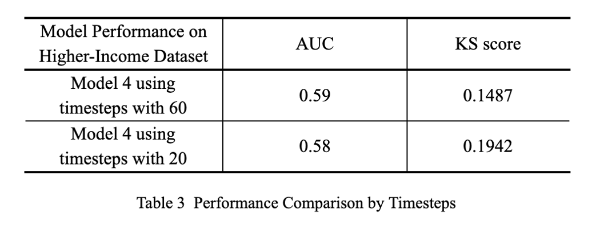
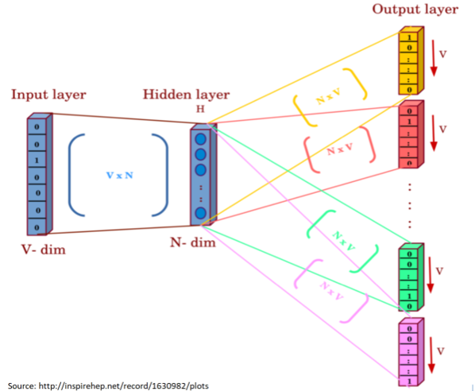
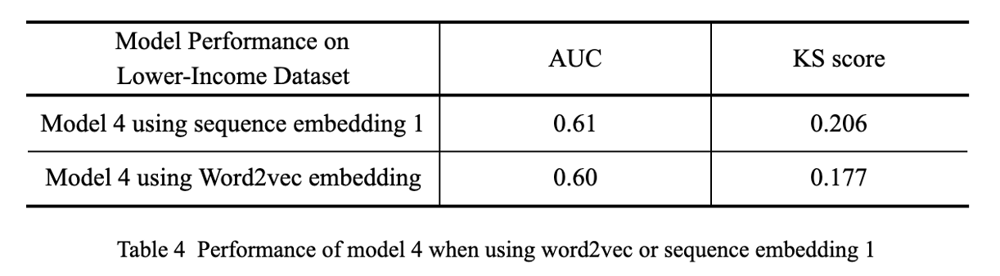
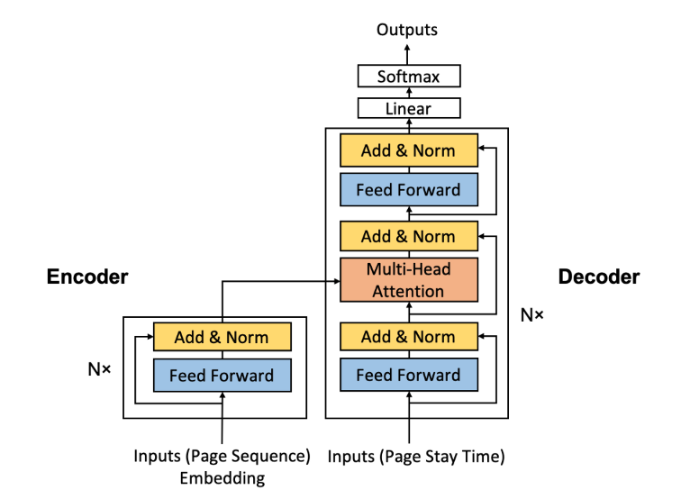
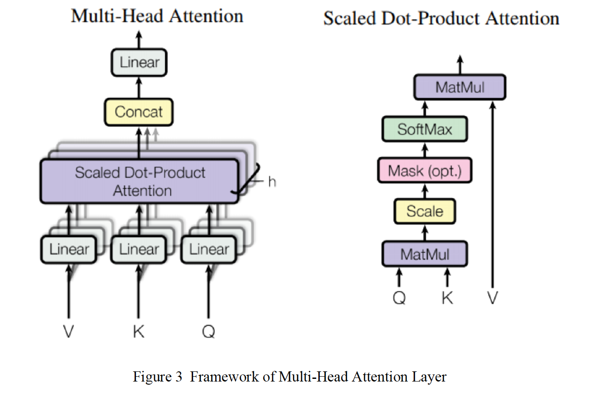

# Fraud Detection with Sequential User Behavior

Online-lending fraud detection with customers' sequential behavioral data (End-to-end ML and NLP project).

## Project Summary

The project goal is to utilize customer’s behavior sequences before submission of the loan application to make fraud detection in the online lending business. We tried different kinds of machine learning classification models and deep learning methods including the state-of-art transformer model with attention mechanism to extract features and make the best prediction ability, measured by AUC and KS statistics.

Based on the data exploration results of some baseline machine leaning models such as random forest and KNN, we further utilized different neural networks to conduct binary classifications, e.g. directly using LSTM layers and bidirectional LSTM followed by CNN layers, to extract features from sequential data and do fraud detection. In all models fitted, the best result came from the model with the combination of LSTM layer and CNN layer. The final AUC equals 0.59 and KS equals 0.1487.

In order to dive deeper, we focused on both feature extraction and model optimization to improve our result accuracy. For better feature extraction, we trained our own skip-gram model on a web page sequence to get the word2vec embedding layer and fed it to the LSTM layers. For the model improvement part, although we tried several optimizations on the LSTM models, the limitation of LSTM maximum timestamps made it not perform well, since it can not learn the relations between sequences when padding size is larger than 20. Thus, we further constructed a new architecture based on the idea of “The state-of-art Transformer Model”, which introduced a multi-head attention mechanism in order to detect the interactions between web page sequence feature and page stay time feature. In this case, there is no more timesteps limitation in our new model, and this variant transformer model is much more flexible in future exploration.

## Background

In the previous fraud detection analysis, people usually focus on the users’ basic information like gender, age, income, family background, and their application date. Although these kinds of information could be treated as features and helped to build machine learning models to detect fraud, there was still lots of information lost during the process. One kind of information it lost was page view behavior. By the development of the Internet, now more and more lending is happening online. As a result, we can record the page view behavior for each customer. Thanks to the development of Deep Learning, we can make the page view behavior into sequence feature sets and fit them into different models.

## Data Description

In this project, we mainly got two datasets. One is the original dataset which was also used by the two previous groups. In this dataset, there are 200000 records of user behaviors sequences before the lending application. We treated people in this dataset as higher-income groups. The fraud occurrence frequency is very low. The other dataset was newly provided by Moffy which got 30000 records of user behaviors sequences. The fraud occurrence frequency is a little higher in the new dataset, and we considered this group as the lower-income. Both the two datasets have the same types of data which showed in the following table.

### 1. Basic Information Features(Non-Sequantial Features) 

Keys | ValueDescription | ValueType 
---|---|---
`label` | Whether this application defaults | int (0-no / 1-yes) 
`overdue` | If application defaults, how many days overdued | int
`new_client` | Whether this user has previous `successful` application | int (1-yes / 0-no) 
`order_time`| Application time | foat from Unix time(ms)

### 2. Page-View Behavior Features(Sequential Features)

Features | Description 
---|---
`pname` | The category of page belongs to
`pstime` | The starting view time on this page 
`petime`| The ending view time on this page
`pid` | The process id
`sid` | The session id

## Data Processing

To feed the data into Deep Learning models, we made some preprocessing.

1. Basic information features (Non-sequential features): For the Basic information features, we think the last group did a good job on it. Thus, we kept the data processing made by them and got each sample as a dimension binary vector.

2. Page view behavior features (Sequential features)
- For the pid and sid, we kept the treatment method from the last group and recorded if the process id and session id changed from the last page.
- For the pstime and petime, we also kept the method applied by the last group. We subtracted from page end time to page start time to get page stay time and subtracted from current page start time to last page end time to get the lag time between each page.
- For the pname, there are 12 different categories of page. Last group encoded them in two ways, label encoding and one hot encoding. We add one more way which uses word2vec encoding. Thus, we totally used three methods.
- Last group found that over 95% of sequences have length shorter than 60 timesteps and therefore they chose a padding length of 60. We kept this padding size in our Transformer Model. However, when we trained the LSTM model, we found 60 timesteps could be useless due to LSTM only accepting 20 timesteps as maximum. Therefore, we chose a padding length of 20 for our related LSTM models.
- As a result, we totally got two main page view behavior sequences data. One is with 60 timesteps, while the other is with 20 timesteps. And we encoded categories of pages into three different length variables. One is using label encoding which only got one column. The second one is using one-hot encoding which got 12 columns. The final one which will discuss one detail in the following used word2vec encoding. We made it 50 columns.
- To determine the effect of length for timesteps, we tested the original dataset on the best model provided by the last group. The result was shown in the following tables. Both the AUC and KS score of the model with 20 timesteps were not too much worse than the values of the model with 60 timesteps. These results could be made by the limitation of LSTM. Although there is an improvement in learning long term items in the LSTM model compared with RNN model, LSTM always can not learn items with timesteps more than 20. When the length of timesteps is longer than 20, the LSTM model will become something like a Markov chain and only memorize the last 20 timesteps. However, in the last 20 timesteps of 60 timesteps input, there are many ‘-1’s which could make errors for the result. Thus, the KS score for the model with 20 timesteps input is even better than the model with 60 timesteps input.

## Feature Extraction and Exploration
### Word2vec Embedding
We experimented feature extraction by RNN(LSTM), where we used three different inputs ：
- Sequence embedding 1: Using one-hot encoded page type, discretized (binned) page stay time and page lag time, and change of pid and sid. In this way, the input shape is (batch size, 60, 17);
- Sequence embedding 2: Using label encoded page type only. In this way, the input shape of LSTM is (batch size, 60, 1);
- Sequence embedding 3: Using discretized (binned) page stay time and page lag time, and change of pid and sid only (without page type). In this way, the input shape is (batch size, 60, 4);
The model performance using ‘Sequence embedding 1’ turns out more effectively.

To further explore this part (making input for LSTM), our group utilized word2vec embedding on “page type” to make inputs. Word2vec is a common technique in NLP. The basic idea of word2vec embedding is to use two-layer shallow neural networks to train a text document (a document consists of one or multiple sentences) and then find an appropriate vector representation for each word of this document. Word2vec is an unsupervised algorithm, so we only need the document as the input without using any labels.

In our project, we regard each page type as a word, and the sequence of web viewing behavior of a single user can be regarded as a single sentence, and then the sequence of web viewing behaviors of all users can be regarded as a document that consists of multiple sentences. Word2vec is a collection of different specific models. These models all share the same property (two-layer shallow neural network) with different specific applications. Our group tried skip-gram model, and the input size using this method is (batch size, 60, 50) where 50 is the embedding size that can be changed as you like.

Further notice: The word2vec model trained by Google set this embedding size as 300, but Google used so many documents and they will give a vector representation to each word in the documents (there are so many words, so they use a 300-dimension vector to represent each), while in our project we in total only have over 10 page types (remember one-page type is equivalent to one word in our case, and it seems we do not need that big a embedding size). 

The performance after replacing the “sequence embedding 1” that the last group did with our skip-gram embedding becomes slightly worse (see table below). But the sequence embedding 1 that the last group did use not only page type but also page stay time, lag time, and so on, while the word2vec embedding only uses page type. So, we still think word2vec embedding is a powerful embedding method, but we need to find some ways to concatenate the page type and other variables to extract more information. Also, further work can include tuning the hyperparameters of the word2vec model.

The reason we compare the performance of model 4 instead of other model architectures is that model 4 is the best architecture we found at present.

### Transformer model with multi-head attention mechanism

In order to explore the interactions between “web page sequence” and “page stay time” features, which are both time-series features and crucial to research on the customer behaviors before submitting a loan application, we constructed our own state-of-art architecture with reference to the traditional transformer model.

The core idea of our Transformer model is attention mechanism---the ability to attend to different positions of the input sequence to compute a representation of that sequence. In this case, we are able to handle input features using attention layers instead of RNNs or CNNs. This architecture has two main advantages:

- Layer outputs can be calculated in parallel in the form of multi heads, instead of a series like an RNN or CNN;
- Long-range behavioral sequences can be learnt. Since we set the padding size equal to 60 in the preprocessing stage, this characteristic can solve the problem that LSTM is not able to learn sequences well when longer than 20 timestamps.

Our transformer model architecture is constructed with two parts, and we will call them “encoder” and “decoder” in alignment with the traditional transformer model.

#### 1.Encoder

The web page sequence after embedding with word2vector method is passed through N encoder layers, which consist of a point wise feed forward network and a residual connection around it followed by a layer normalization.

The point wise feed forward network contains two fully-connected layers with a ReLU activation in between. Residual connection helps in avoiding the vanishing gradient problem in deep networks.

After learning with N encoder layers, the output for each web page behavior in the sequence is then generated and ready to enter the decoder as the input.

#### 2. Encoder

The decoder attends on the encoder's output and its own input (Page stay time) to predict whether the customer defaults. There are N decoder layers in our transformer model in total, each one consists of two point wise feed forward networks and a multi-head attention layer, and every sublayer has a residual connection around it followed by a layer normalization.

Below is the idea behind the multi-head attention layer, which consists of four parts: linear layers and split into heads, scaled dot-product attention, concatenation of heads and the final linear layer. The multi-head attention layer takes three inputs: Q (query), K (key), V (value), and they are passed through dense layers and then split into multiple heads; Each head is applied with the scaled dot-product attention layer; The attention output for each head is then concatenated; At last, the concatenated output is put through a final dense layer.

Multi-head attention is utilized because it allows the model to jointly attend to information at different positions from different representational spaces. After the split each head has a reduced dimensionality, so the total computation cost is the same as a single head attention with full dimensionality.

In our case, V(value) and K(key) receives the encoder output of the customer’s web page sequences, and Q(query) receives the output of page stay time sequence from the decoder’s first point wise feed forward network sublayer, the attention weights represent the importance given to the decoder's input based on the encoder's output. In other words, the decoder predicts whether the customer defaults by looking at the encoder output of the “web page sequence” behavior and self-attending to its own output of the “page stay time” behavior.

The performance of the Transformer model can be seen in Table 5. The result is not as expected that we think this is due to the lack of feature dimension. Only the sequence data itself may not include enough distribution information.

## Conclusions and Future Extensions

In this project we applied ways to extract features from sequential behavior data, improved the previous model, and explored the state of art model Transformer.

- As a novel model, we use Transformer for its advantages compared to CNN and LSTM for sequential data. It uses multi-head attention to fix some problems with LSTM in longer memory and efficiency problems. We use Word2Vec embedding as a new feature extraction way to have an expression of the behavior sequential data.

- In a more general way, we can regard the Transformer model as an ensemble model. It emblems two subnets with multi-head attention in order to link sequential data with stay time data. The subnets could not only be the vanilla multi-head attention layer, but ensemble two LSTM subnets is also a feasible way. We could learn from the Residual Network to ensemble multiple relatively networks.

- For the Transformer model, it offers a new way to contact the web sequence data and page stay time. Without directly adding a DNN layer, the output of the Transformer model could be the same shape as web sequence data. The output which shape is the same as sequence data now was added by the factor of page stay time. We hope the next group could treat this output as an input to an LSTM model and detect if there is an improvement compared to LSTM model with web sequence as input.

- Also, generator models could be used to solve the imbalanced data problem. Such as the One Class GAN model that the previous group has tried could still be an attemptable method.

- Though we tried several networks to predict the result of fraud behavior, the result is not as expected. We have complemented the feature extraction ways of the previous group, but the result is still not good enough. More ways of feature extraction could be explored. As in the sequential data, there’re 50 vector dimensions. When other non-sequential data is concatenated to it, the performance is not good. In the future more ways could be tried to map non-sequential features such as applied time with sequential features.
